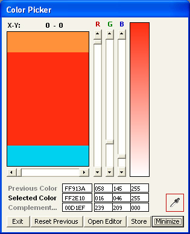



## ColorMate 5\.0

### Description

Color selection in many programs, e.g. Adobe PhotoShop suffers from the inability of the color pipette to function outside the main form of the application. This small program enabeles you to grab color information from any element (pixel) visible on the screen and include the selected color in a color scheme as one of up to ten colors.

The update to version 5.0 corrects several items and includes display of editable complementary colors.

Details at:

http://www.swr.dk/software/02_00_colormate.php
 
### More Info
 
Selfexplanatory after some experimenting. No user manual.

Color hex value of selected color. Palette file including uo to 10 colors.

             |
---                |---
**Submitted On**   |2008-09-05 14:10:16
**By**             |[S\.W\. Rasmussen](https://github.com/Planet-Source-Code/PSCIndex/blob/master/ByAuthor/s-w-rasmussen.md)
**Level**          |Intermediate
**User Rating**    |5.0 (65 globes from 13 users)
**Compatibility**  |VB 6\.0
**Category**       |[Complete Applications](https://github.com/Planet-Source-Code/PSCIndex/blob/master/ByCategory/complete-applications__1-27.md)
**World**          |[Visual Basic](https://github.com/Planet-Source-Code/PSCIndex/blob/master/ByWorld/visual-basic.md)
**Archive File**   |[ColorMate\_212596962008\.zip](https://github.com/Planet-Source-Code/s-w-rasmussen-colormate-5-0__1-67651/archive/master.zip)

